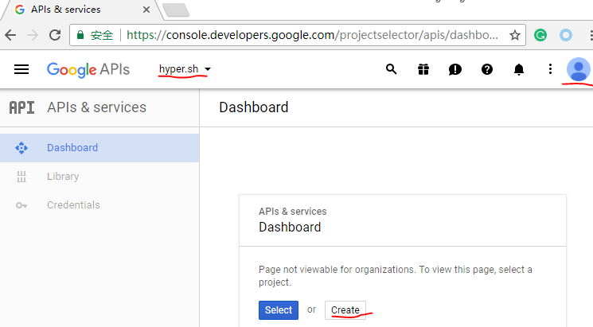
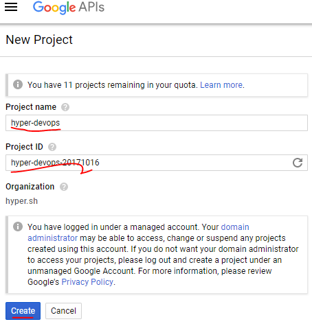
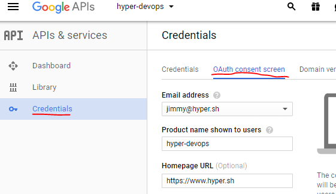
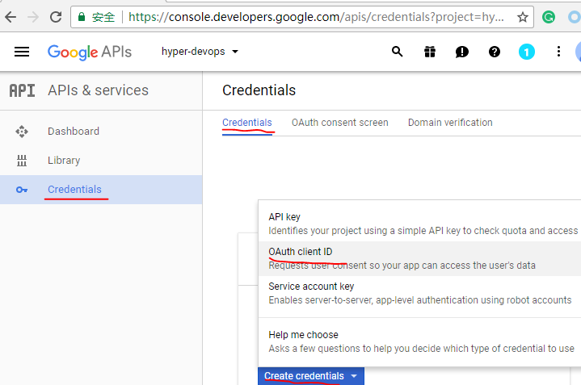
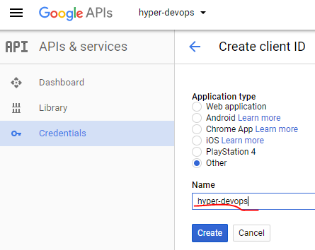
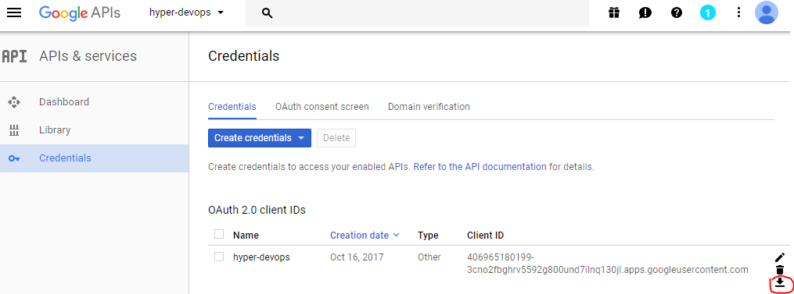
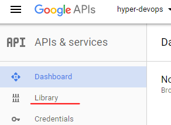
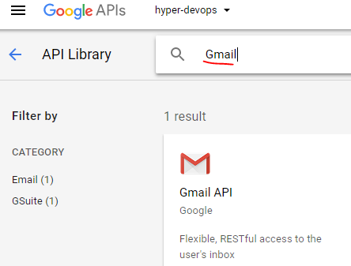
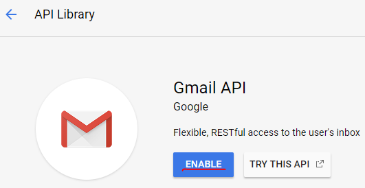

Configure OAuth2 authentication
========================================

# Create Client Secret for OAuth2 authentication.

## open google developer console

First of all you need to log into your google account and go to the [developer console](https://console.developers.google.com).
This will list all Google API projects you are using already and allow you to create new ones.

## create project

Click the "Create" button:

## config OAuth consent screen

## create Oauth Client ID

## download Client Secret

Click the download icon, a json file will be downloaded. The filename will be `client_secret_<clientID>.json`
rename it to `client_secret.json`

# Enable Gmail API

