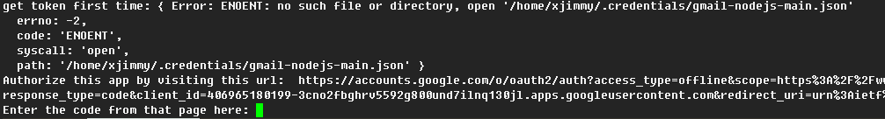
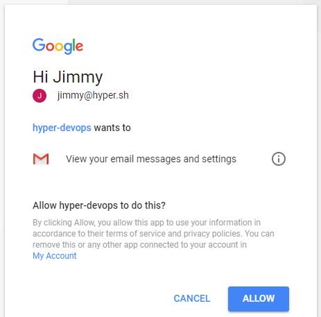
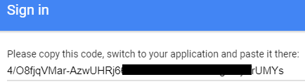

First time run
==============

When run program first time, the file ~/.credentials/gmail-nodejs-main.json isn't exist.
it will get the token, and save it to the file(gmail-nodejs-main.json)

```
$ proxychains4 -q node main.js
```




Open the above url, then click "Allow" button  



A code will be return  
